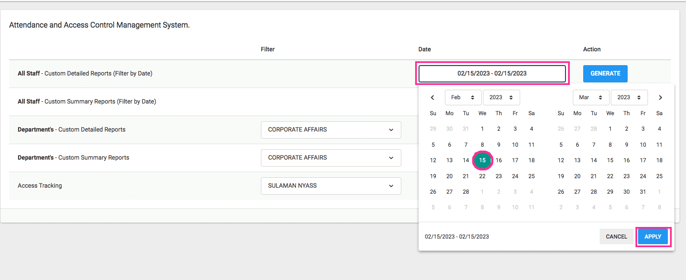
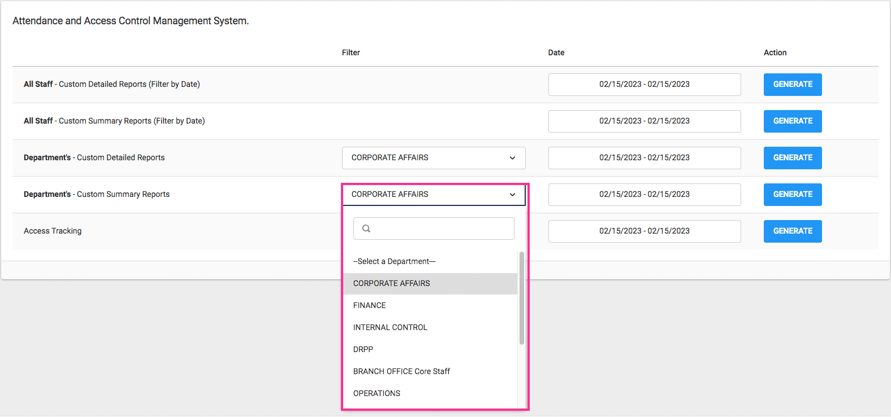
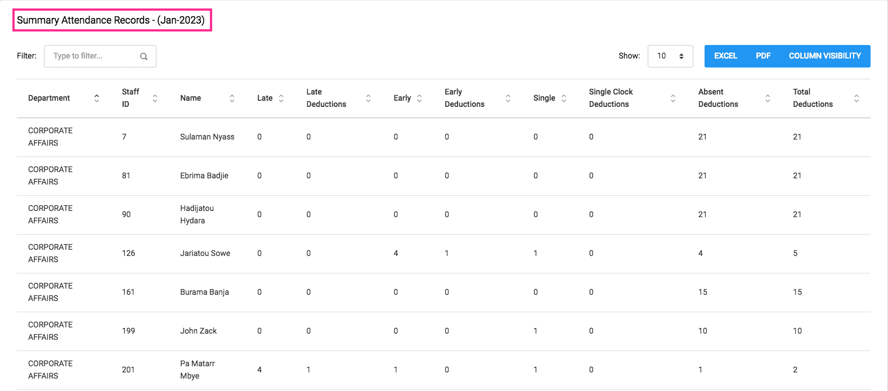
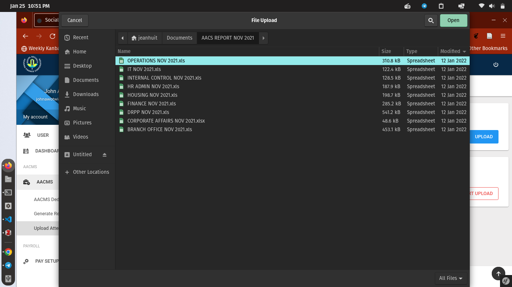
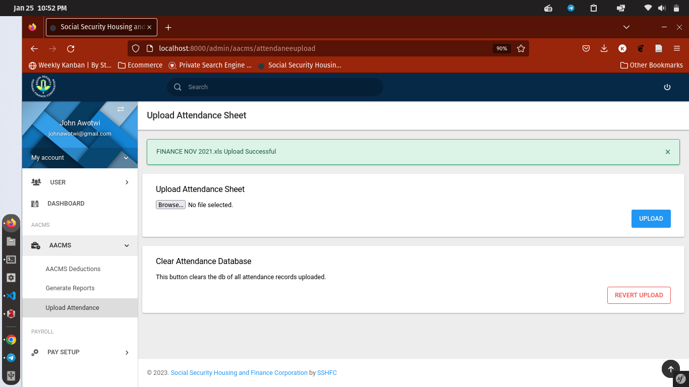

# Introduction

The Attendance and Access Control Management System (AACMS) is a system designed to keep track of all official staff movements. 

## Who Benefits From The Attendance And Access Control Management System

- Human Resource Management Personnel
- Information Technology Officials
- Members of Management

## System Input

- Staff Daily Clock-Ins
- Postings from the Human Resource Management System 
    
## System Output

- Summary Attendance Report
- Summary Access Control Report
- Detail Attendance Report
- Detail Access Control Report
- Individual Deduction Calculation

## AACMS Module

Upon a successful sign in, a dashboard is displayed as shown in Figure 4.
Highlighted in red, is the AACMS module.
{ align=center }

In this instance, we will be looking at the AACMS module. This module helps generate various reports as outputs based on member/staff attendance. Clicking AACMS in the dashboard or on the sidebar opens a portal that allows users generate various reports as shown in Figure 5.
{ align=center }

There are several options / reports that can be generated,using the options provided on the main page. Detailed and Summary reports, filtered by ``dates``, ``departments``.

Also included is an Access Tracking Module. This feature helps track staff movement withing the SSHFC premise.

{ align=left }
{ align=right }

## Filtering Detailed Reports By Date

The detailed report can be filtered by dates. The filter generates information within a date range.
See Figure 8.
{ align=center }

Below is a sample, generated between the date range **1st to 27th of November 2021**
{ align=center }

## Filtering Detailed Reports By Department
A detailed report can also be filtered by department as shown in Figure 10 and 11. A list of departments are generated in a dropdown to make selection easier.
{ align=left }
{ align=right }
## Working With Reports

All reports come with certain functionalities, they are:

- Ability to export into pdf.*
- Ability to export into excel.*
- Ability to search by any of the fields in a multi-field search box. **
- Ability to perform basic sort functions: Ascending and Descending.***
- Ability to limit column visibility. *

The figures below point out these functionalities.

{ align=center }

Output for Excel and PDF exports.

{ align=center }
{ align=center }

## Reducing Columns
The Ability to Limit or Select visible columns is done by clicking the **column visibility** button and selecting out of the drop-down, options you want to make hidden.
See Figure below.
{ align=center }

## Filtering Reports By Name
Using the filter/ Search box. You can search for anything. See figure below.
{ align=center }

## Filtering Summary Reports By Date

This functionality is a similar process to filtering and attendance report by date. 

## Dates on Report
Reports now have the dates of the generated files on the printed document.
{ align=center }

## AACMS Upload

This is a functionality that allows a person with permission the ability to upload excel files exported from the attendance capture device into the AACMS module.
Once granted permission with the module installed, the drop down brings you to the upload functionality.

{ align=center }

Once you click on the browse button, a dialog box opens up allowing you to select the excel file.

{ align=center }

The file is selected and upload done by clicking the upload button. Confirm request to have upload done.

{ align=center }

A successful upload is shown below.

{ align=center }

A feature as seen in the image below, comes up to prevent the upload of same named document.

{ align=center }

If it so happens that an error is commited, a wrong file uploaded, you have the ability to empty the database to provide a clean slate.
Use the 'Clear Attendance Database Option' as shown below

{ align=center }
## AACMS Deduction

This functionality allows one with persmission to initiate the calculation of absentism of staff and place a monetory value to it. This value is then posted to payroll for deduction during the period for payroll run.

{ align=center }

The drop down, under the AACMS module: ** AACMS Deductions** opens up a page that displays a daterange selector, allowing one with permission to select the range of dates for which deduction calculations are to be done. Next is to click ** Generate**.
Once this is done, a list is generated that has the list of staff and number of deductions calculated. The view deductions button becomes visible. 

{ align=center }
Clicking on this button, cleans up the table and makes the deductions ready for posting to the individual deductions table in payroll.

{ align=center }

On this page, the ** Post Deductions** and  ** Revert Deductions** become visible. Clicking on the Post deductions button completes the process. The revert Deductions button, reverts the process to the beginning.

{ align=center }

If there are existing deductions in the individual deductions table ,the process will quit with an error. This will mean, the payroll has not been run.
After each run, the deductions table is cleared.

{ align=center }