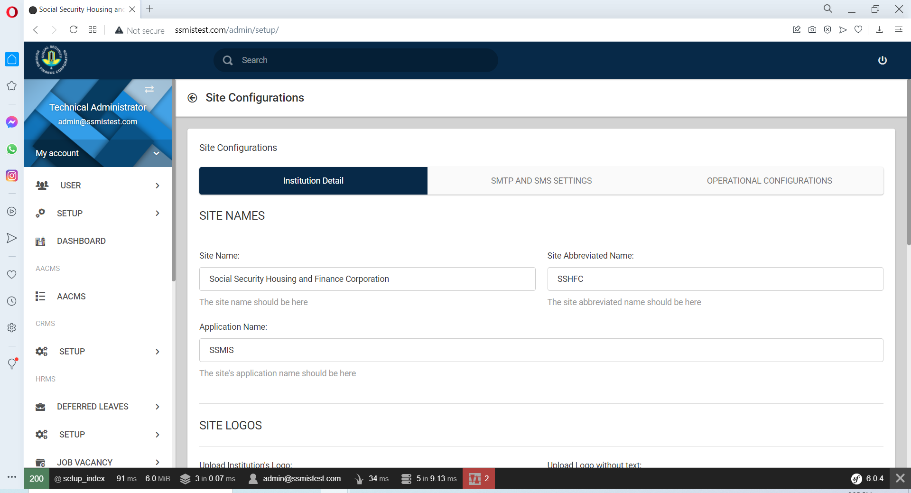
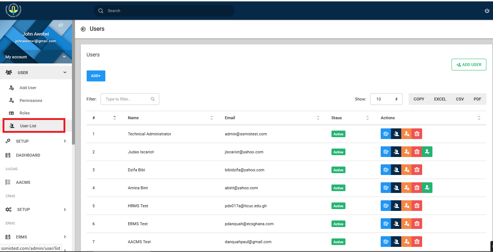
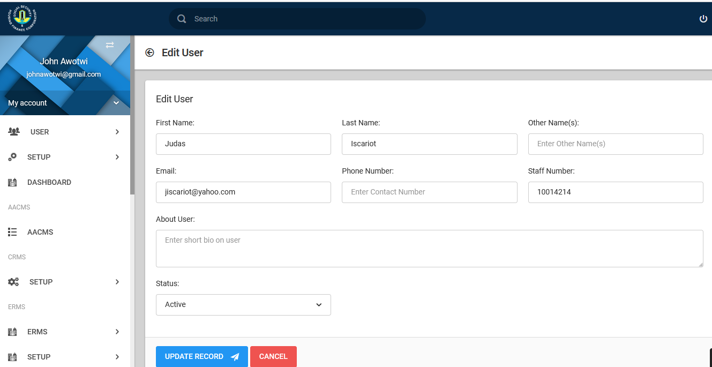

# Introduction

The Administrative User Manual guides the administrator of the SSMIS to set up the appropriate operational parameters for the system's routine operations and user management.

## System Input

- Authorized Administrative Staff 

 
## System Output

- Controlled operation of the entire SSMIS

 
## Administrative User Module

Upon successful sign-in, an administrative dashboard is displayed as shown in the figure below with the key menu items “User” and “Setup”. The menu items for the administrator are also displayed on the left panel of the screen, either option is clickable to redirect the user to the preferred menu item.

{ align=center }

## System-Wide Configuration

{ align=center }

A click of the “Setup” menu item displays a site configuration page as shown in the figure below with options of configuring “Institution Detail”, “SMTP and SMS Settings”  and  “Operational Configurations”. The “Institution Detail” tab provides the administrator the opportunity to configure the site names to be used as the SSMIS application is used, site logos and relevant contact information for SSHFC.

*showing institutional details*
{ align=center }

*showing logo setup*
{ align=center }

*showing setup for site config information*
{ align=center }

The “SMTP and SMS Settings” tab as shown in the figure below provides the administrator the opportunity to configure mail server addresses with corresponding port numbers and relevant authentication credentials. 

{ align=center }

The “Operational Configurations” tab provides the administrator the opportunity to enter other system wide parameterized configurations.

## User Management

{ align=center }

A click of the “User” menu item displays a site configuration page as shown. This page allows you to add users, create roles and permissions for each user and display a users list..

{ align=center }

### Adding a User

Click the **Add User** button to add a new user. 
Fill in the reuquired field and set user as active or inactive.
Click on **Submit** to initiate the create user process. 

{ align=center }

The successful creation of an account can be viewed upon clicking the “User List” menu item on the left panel of the screen. The output is as displayed in the figure below with the respective icon functional descriptions in the following image.

{ align=center }

Functional Icon Description

{ align=center }

### Edit a User

The selection of  “Edit User Details” displays screen fin figure 14 to enable administrator edit user details.
{ align=center }

### Manage a User's Role

The selection of  “Manage User Roles” displays the image below.  It grants the administrator the ability modify user roles, thus assigning a user to a specific role or otherwise. Users can belong to multiple roles.

{ align=center }

### Reset User Password

The selection of  “Reset User Password” displaysthe image below. This enables administrator reset user password to the default of first initial and last name concatenated.

{ align=center }

### Delete a User

The selection of  “Delete User Account” displays screen in the figues below that prompts the administrator to confirm user account deletion. 

{ align=center }

Upon creation of user accounts, emails are sent to users with a button to be clicked by the user for account activation. In the event that functionality fails, the administrator has the option of activating the account by clicking the  “Verify and Activate User Account” button which displays the image below for confirmation.

{ align=center }

## User Permissions

The user permissions component has three integrated sub components. These are namely the role, permissions and user. 
A role must first be created as in the image below:

{ align=center }

Next permission is then assigned to the role,

{ align=center }

A created user can then be assigned to the relevant role(s).
The permissions assigned to roles/user are based on the respective sub systems as shown below:

{ align=center }

The sub systems have numerous permissions for which the option of “allow” or “deny” is provided for selection.

{ align=center }

Summary Steps in User Permissions Management

-  Create or Select Relevant Role.
-  Ensure the appropriate permissions are assigned to the role for the specific sub system. 
-  Create or Select the user, select manage user roles and assign user to the preferred role.
-  Click Save button after each process is completed.