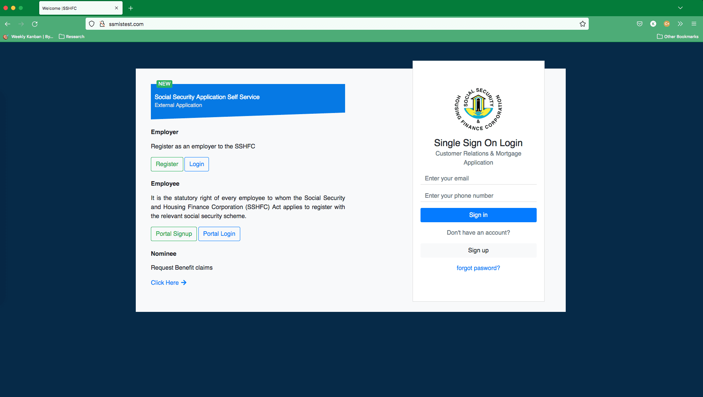
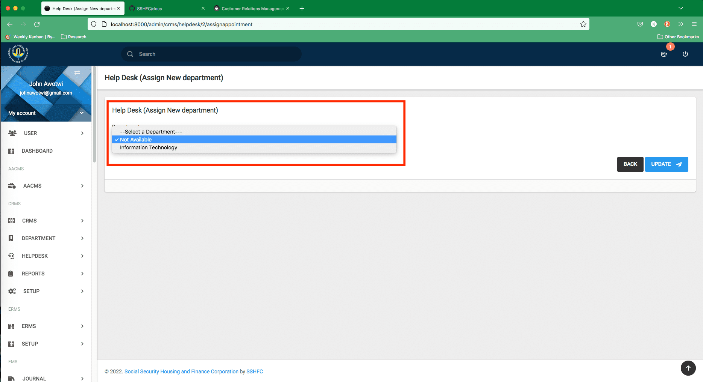

# Introduction

The CRMS is the public-facing component of the SSMIS hence all requests, applications and payments will be routed via CRMS for the respective public/members’ service interface.

## Who Benefits From The Human Resource Management System

-  The general public
-  Members of Management
-  Information Technology Officials

## System Input

- Requests for Information
- Requests to Book Appointment
- Submissions of Complaints
- Mortgage Application

## External Users

This whole process begins when an external user, visits the public-facing website of SSHFC. As shown in the image below.
{ align=center }
This page gives you access to the SSMIS, MMS and CRMS public facing sections.  Both the Mortage application and CRMS module have a common sign-in interface , as seen in the image above.

### Sign Up

To take advantage of the CRMS the general public will first need to sign up for the platform. 
This requires an email address, phone niumber as well as other pertinent details.
{ align=center }

### Sign In

To log, into the system, one will need to be authenticated, via a username and password. After providing these details, the system grants you access to your portal where you will be allowed to submit various requests.

- Requests for Information
- Requests to Book Appointment
- Submissions of Complaints
- Initiate a mortgage application
 
 { align=center }

 After you successfully sign-in you are sent to the homepage, from which point you can access all other sections. See below:

 { align=center }
### Request for Information

Under this tab, a user can request information.
Here, the customer is given the opportunity to submit his question or request for information.

{ align=center }

On the Tab - Request for information, click on the **Make a Request** button. This action opens up the page you see below:

{ align=center }

### Book Appointment

Under this tab, a user can book an appointment.
A range of dates and times are available for the user to select. However, an approved date will be communicated when the request is officially acknowledged.
{ align=center }
Clicking on the **Request an Appointment** Button opens up a page that allows you to select possible dates and times for an appointment. See below:
{ align=center }
### Submit a Complaint

Users of this portal are given the chance to also submit complaints they might have about SSHFC.
{ align=center }
Complaints are captured in the text field highlighted.

{ align=center }

### Track your Submissions

Also, is the ability to view the outcome of your submissions once they have been worked on.
This is indicated by the status message on each module. Once you click on a module: complaints, appointments, information requests, you are able to submit a request as well as view the status of requests that have been already made.

{ align=center }
Highlighted in the image above are:

- Status: Tracks the state of your submission
- Filter: This allows you to search and filter from your list of submissions
- Action: Allows you to perform actions like edit, delete, and view your submissions
- Exports: This allows you to export your data in any of the listed formats
- Show: This allows you to determine the number of rows visible at any one time.

## Internal Users / Members

Internal users and Members also have the ability to Book Appointments, Submit requests for Information & Make Complaints. 
The process to do these are similar to the processes outlined above.

{ align=center }
Complaint Page

{ align=center }
Enquiry Page

{ align=center }
Appointment page

However, Internal users have the ability only limited by the permission and role granted, to coordinate and approve requests that come through the system.

### HelpDesk

This role is the glue that binds requests and bookings that come in with the responsible party or department qualified to manage such a task.
The person or department assigned these tasks, will have the opportunity to work on all complaints, booking and information requests that come into SSHFC through the system.
These are grouped into external and internal requests, to differentiate requests that come in through the public interface and those that are generated from within.

{ align=center }

In the HelpDesk portal, you can review requests, assign responsible departments meant to take care of the issue and determine the level of urgency.
{ align=center }
Above is an image showing the appointments, under the HelpDesk section.
Below is the snapshot of External Appointments, Highlighted are the registered columns, and action column that mark if a job has been seen and attended to and the various actions that can be taken. 
{ align=center }

{ align=center }
Above are highlights showing what fields are available to the help desk personnel. These allow the helpdesk to submit extra details and information to the responsible department.
Issues worked upon are then redirected to the department assigned to resolve said tasks.

When issues have been pending for a longer time than usual, the person in charge of the help desk has the opiton to re-assign the issue to another department. This is done using the re-assign button. As shown below.
{ align=center }
The screen that shows next, allows you to select from a drop down, the list of departments available.
{ align=center }

### Department
This role handles the requests that are assigned on a department basis. As such only issues assigned to the department are seen in this portal.
Approvals, answers to queries and complaints are submitted here, for onward submission to the user who initiated the process.
The image below shows the Department's Interface for External Complaints.
{ align=center }
The image below shows the Department's Interface for Internal Enquiries.
{ align=center }
What you see in the image below is the interface that allows Department personnel to manage resolutions.
{ align=center }
The image below shows, the aspect of the Department Help Desk, that list out a completed submission. The view option gives you an uneditable list of transaction records.
{ align=center }
### Track your Submissions

Also on this portal,  is the ability of each role assigned to the task to track, search and filter through all submissions that come through the system.

## Email Usage
The system is designed to send email prompts throughout the lifecycle of a request submitted through the portal.