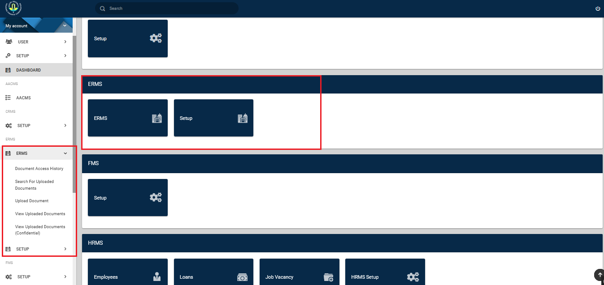
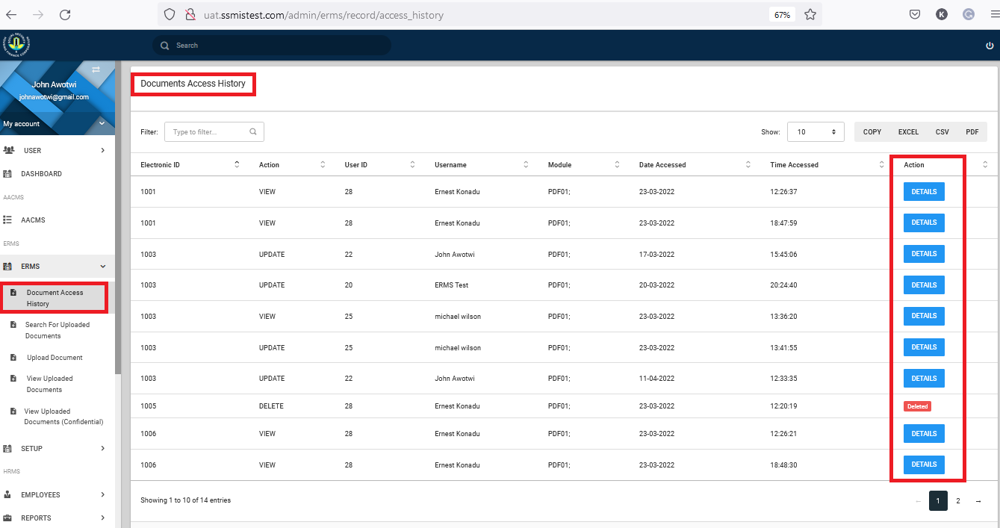

# Introduction

The Electronic Records Management System [ERMS] is designed to facilitate the Generation of Reports on scanned documents periodically and track Staff Performance based on users’ “numbers”/ departmental records.

## ERMS Module

Upon a successful sign in, a dashboard is displayed as shown in Figure 4.
Highlighted in red, is the ERMS module.
{ align=center }

## Document Upload

Fill in details of confidentiality, title of document, description, record type & link, author, keywords, document tag and any attachments needed to be added. To upload document, Click on the  **ERMS** button. This should display a dropdown, on which you will find **Upload a Document**. See Image below:
{ align=center }

Upon clicking the **Upload a Document** button, the page below is displayed, allowing you to enter details of the document to be uploaded. You are also given the option to select multiple documents to be uploaded. Each document [PDF] is allowed a maximum size of Ten (10) Megabytes.
Allowed filetype is the PDF.
{ align=center }

## Update Records

View uploaded data using the “View uploaded data” or "View uploaded data (confidential)" tab on the left panel. You can now view all entries with their respective descriptions by filtering. 
To update or delete these document entries, you can use the update or delete buttons to the right of each record, or click on the record's Electronic ID.
See images below:

*Showing the ERMS view uploaded Document tab*

{ align=center }
{ align=center }

*Showing the ERMS view uploaded Document tab confidential*

{ align=center }
{ align=center }

*Showing update view*
{ align=center }

When the **Update button** or **Electronic ID** is clicked, The update view is displayed to allow updates for the particular document uploaded. Click **Update** when you are done with editing.

## Search Records

To search for an uploaded document, you click on the **Search for Uploaded Document** tab. 
This opens a view allowing you to search for a document, using any of its details including and not limited to: 
*Electronic ID* , *Description* , *Record Type*, *Keywords*, *Title* etc.

Below is an image that shows a search using the "Author" and the results displayed.
{ align=center }

## Docuement Access History

The ERMS module also allows you to track the access history of documents. Who accessed the document, when it was accessed.
Below is an image that demostrates the use of the Document Access History Tab.

{ align=center }

Below is an image that shows the detailed view of the documents acces history when clicked.

{ align=center }

