# Introduction

This user guide provides guidelines on how to use the Mortgage Management System (MMS) platform which is one of the Financial Management Systems.

{ align=center }

## Dashboard
The setups section has different elements of Accommodation Types, Email Templates, Interest Rates, Plot Sizes, Projects, Property Details, Property Locations & Property Types.

{ align=center }

## Setups
### Accomodation Type
The accommodation types tab directs you to a page with a list of various types of accommodation with their descriptions and actions.
Select the “Add Accommodation” tab to add new accommodation type with description.     

{ align=center }

Enter in the accommodation type and description to submit. Also select the “Back to List” tab to return to accommodation type full list.

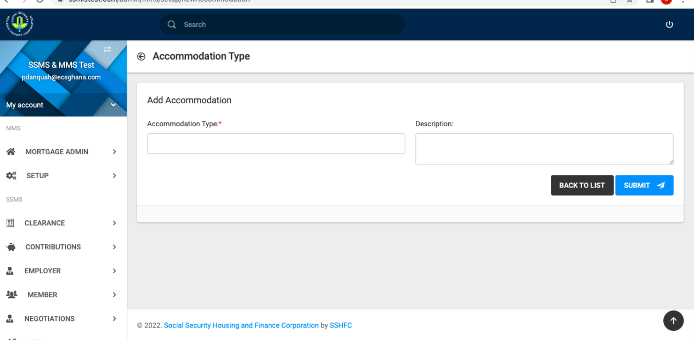{ align=center }

### Email Templates
The email templates tab directs you to a page where you can view email templates setup showing the various titles, body, module, status and actions of mails. The “Add Mail Template” tab gives the opportunity to add on to the list of mail templates by filling in the needed information.

{ align=center }

### Interest Rates
The interest rates tab is located on the left panel. Select this tab to view any records available and to update with new information.

{ align=center }

{ align=center }

### Plot Sizes
View details on the sizes of plots available on this tab. Updates can also be made to the Plot Sizes list.

{ align=center }

Add plot size from drop down with description to submit.

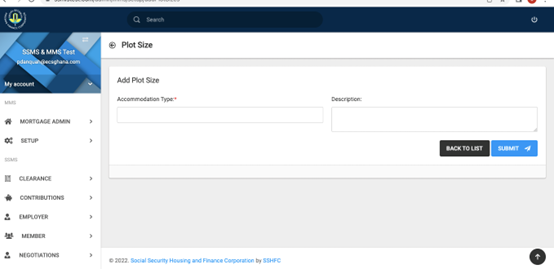{ align=center }

### Documents Signature

This feature allows signature files to be uploaded and displayed on documents

{ align=center }

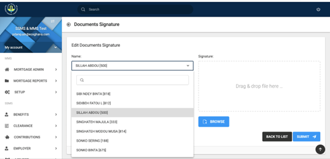{ align=center }

### Projects

The Projects tab has a list of all project types, their status and current actions

{ align=center }

Projects list can be updated by entering all compulsory fields with information on Project type and active status

{ align=center }

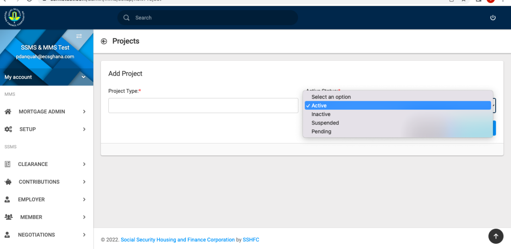{ align=center }

### Property Details

Property details list is available on the "Property Details" tab. However, this can be updated using the "Add Property Details" tab

{ align=center }

{ align=center }

{ align=center }

{ align=center }

### Property Types

All property types available are described on the list of this tab. Updates can also be made using the "Add Property Type" tab.

{ align=center }

{ align=center }

## Mortgage Administration

The Mortgage Administration feature under MMS is set up to allow customers and users of the platform to register for mortgage and either pay out rightly for a property.The Mortgage Administration Feature section has different elements of Mortgage Registration, Applications, Qualified Applications, Disqualified Applications, Mortgages, Outright Purchases, Payments, Payment Details, Title Deeds, Journals.

{ align=center }

### Mortgage Registration

A user needs to first register on the Mortgage application portal for the application to be assesed

{ align=center }

The registration platform requires details on the user which are required to be saved and submitted to continue

{ align=center }

{ align=center }

{ align=center }

### Applications

The first step of the mortgage application process is for a client to apply. All applications from clients are assessed and either qualified or disqualified for interviews. Ideally, all qualified applicants are shortlisted and later issued offer letters for a property. 
Once payments are made by clients, they are then allocated and the system is updated with client’s details. The entire update is mainly for interest calculations and mortgage on property.
Regular repayment are monitored and notifications are given upon repayment in the form of SMS, letters or E-mails. Upon payment of the necessary legal fees title deeds are now processed and issued. 
The first tab which is the Applications tab enlists all mortgage applicants names when registered with the application type be it outright payment, particular project, applicant’s name, date submitted, qualification status and actions to be taken. These applicants are either qualified or disqualified using the action tab.

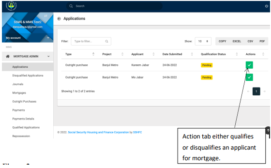{ align=center }

{ align=center }

{ align=center }

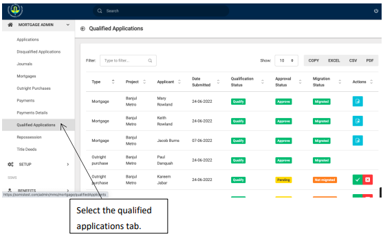{ align=center }

### Qualified Applications

All applications from clients are assessed and either qualified or disqualified for interviews. Ideally, all qualified applicants are shortlisted and later issued offer letters for a property. 
View all qualified applications list on screen. Some applicants may however not be qualified yet and will need to be using the action button.

{ align=center }

{ align=center }

{ align=center }

{ align=center }

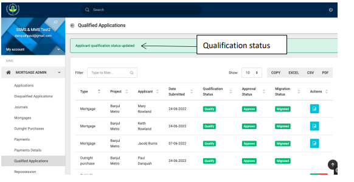{ align=center }

### Disqualisfied Applicants

{ align=center }

{ align=center }

### Mortgages
{ align=center }

{ align=center }

#### Mortgage Details - Personal Information

{ align=center }

#### Mortgage Details - Property Information & Loan Information

{ align=center }

### Outright Purchases

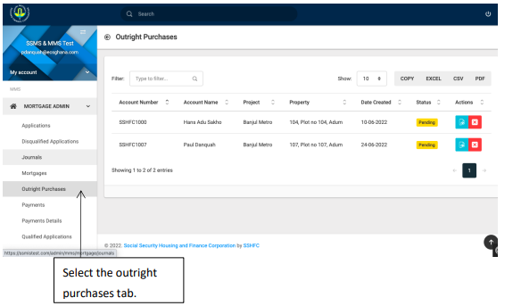{ align=center }

{ align=center }

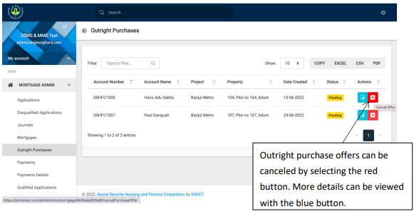{ align=center }

{ align=center }

### Payments

{ align=center }

### Mortgage Payment Details

All details on individual payments can be viewed on the Payments Details tab. Type in account number and select the search button

{ align=center }

### Title Deeds

{ align=center }

New title deeds registration require account number to be selected from drop-down option. Any other notes cab be written at the notes section

{ align=center }

### Journals

{ align=center }

In raising a journal, a user must fill in all required fields with account option, amount, action, payment type and reason to submit.

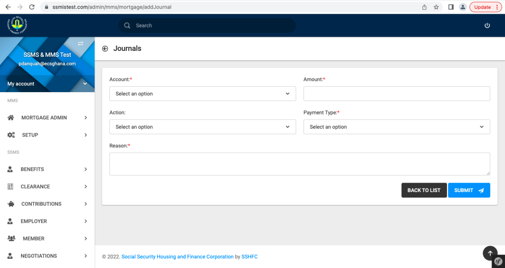{ align=center }

### Mortgage Repossession

The system allows for mortgages to be repossessed. However, three consecutive missed payments by 15th of every month will result in mortgage being marked for foreclosure. The first missed payment warrants demand notes in the form of e-mails, SMS, generated letter. Second notifications are usually sent upon missed payment default not redeemed based on negative arrears for second consecutive month being the 15th. Third notifications also in the form of e-mails,SMS, generated letters are sent out ot inform clients of repossession based on negative arrears for the third  consecutive month, 15th of every month.
There is an automated freeze of account and discontinuation of interest calculation.  These marked mortgages can either be re-activated with the appropriate approval or be foreclosed. Either unfreeze or repossess by General ledger update/reversal for interest repayment and principal.

{ align=center }

## Reports

Detailed reports can be generated on the Mortgage Reports tab. Reports are available for client mortgage statement,down payments,mortgage arrears,mortgages,outright purchases,project clients report,property history.

### Client Mortgage Statements

{ align=center }

{ align=center }

### Down Payment

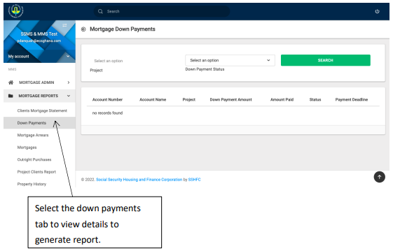{ align=center }

{ align=center }

### Mortgage Arrears

{ align=center }

### Mortgages

The mortgages tab gives a view of all details on mortgage applications of which status can be selected and searched for to generate report

{ align=center }

{ align=center }

### Outright Purchases
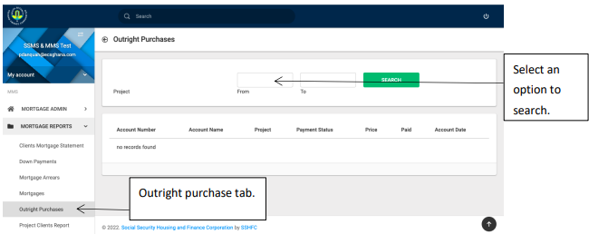{ align=center }

### Project Clients Report

{ align=center }

### Property History

{ align=center }

In conclusion, and a gentle hint, setup records linked to other records in this same application can not be deleted unless they are de-linked.

