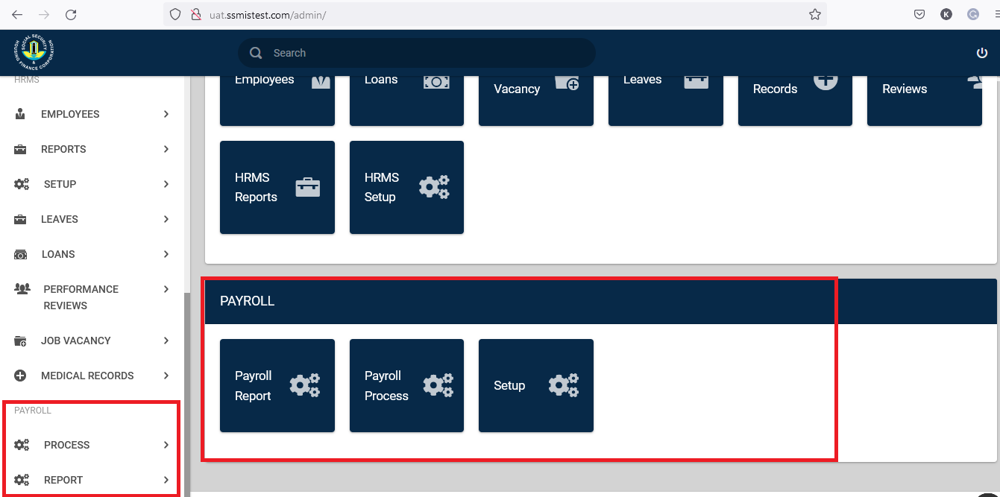
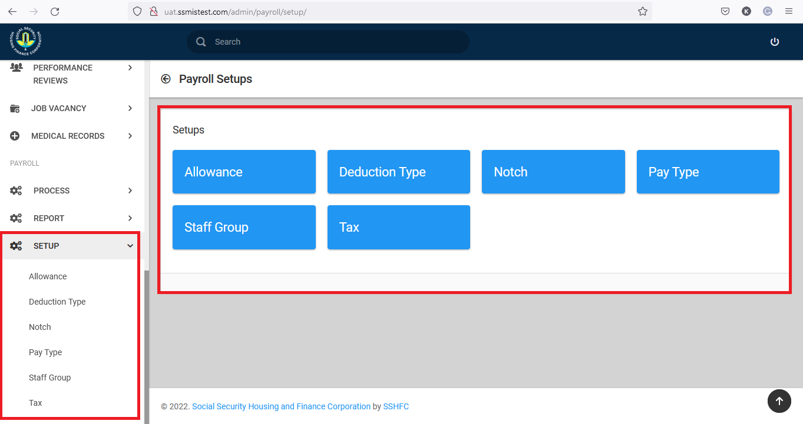
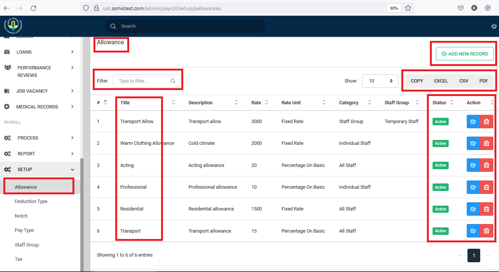

# Introduction

This user guide provides guidelines on how to use the Payroll platform which takes records of all employee details on Allowance, Deduction Type, Notch, Salary, Staff Loan & Tax.
{ align=center }

## Dashboard

The following view is presented to you when you select the setup dropdown under **Payroll**
{ align=center }

## Allowance Setup

This setup enlists all the benefits/allowances available to employees with their rate units.
{ align=center }

The above image, shows the interface you are greeted with, when you select allowance under the setups. 
This shows all allowances that have been setup in the system. You have the ability to filter out allowances based on the name, description etc. On this page you can create new allowances, by clicking on the **Add** button.

{ align=center }

When thee **Add allowance **button is clicked, you are presnted with a page that accepts certain details that make up an allowance.
The Allowance Rate is a value, either in fixed rates or a percentage, this option is available as a drop down under allowance rate values.

Use the save button to complete the entry.

## Deductions Setup

{ align=center }

Deduction Types listed show all staff contributions, employer contributions, contribution unit, category, staff group as well as the actual deduction type name. 
New records can however be added to already existing list. 
Adding a new record, will require that you click the **add record** button.

{ align=center }

Deduction Type Setup can be updated after selecting the “Add New Record” tab. Type in the deduction category code, deduction name, employee contribution and other needed details to add new deduction type to save.

{ align=center }

Using the actions buttons to the right, you can update existing deductions.

## Notch Setup

This setup shows the various salary grades with their values and tax values.

## Salary Setup

## Staff Loan Setup

The Staff Loan tab shows all available loans that are available to employees with the duration minimum & maximum, status of deductibility, interest rate attracted &  current status. Staff Loan records can be edited or deleted with the blue or red action buttons.

## Tax Setup

The Tax tab details all bands with their tax rate,tax value and their current status
